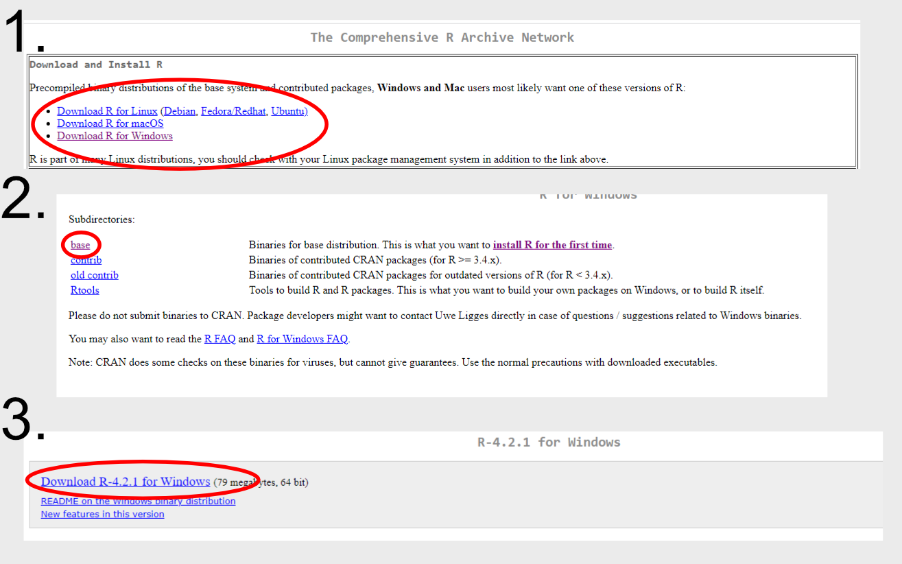
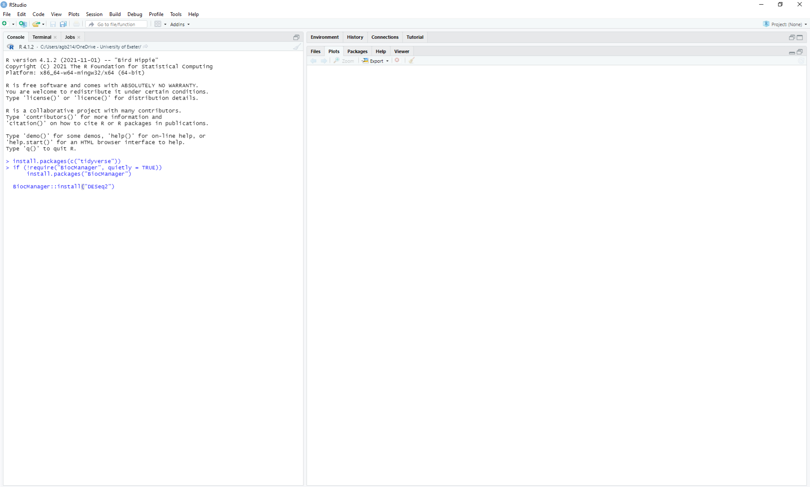
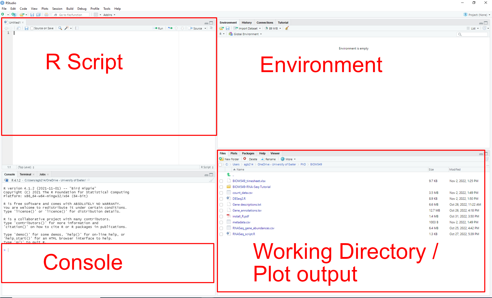

```{r setup, include=FALSE}
knitr::opts_chunk$set(echo = TRUE)
knitr::opts_knit$set(root.dir = "C:/Users/agb214/OneDrive - University of Exeter/PhD/BIOM549/")
knitr::opts_chunk$set(fig.width = 12, fig.height = 8)
```

# Introduction

## Live worksheet
https://ash-bell.github.io/BIOM549-RNA-Seq-Tutorial/

Welcome to the BIOM549 bioinformatics workshop. The goal of this
workshop is to provide you with some basic insight in how RNA-Seq data
sets are analysed. Using this worksheet we will cover the following
Intended Learning Outcomes (ILOs) for this module.

4.  Interpret experimental data obtained using experimental techniques
5.  With minimal guidance, deploy established techniques of analysis,
    practical investigation and enquiry within the biosciences
6.  Critically evaluate experimental data

## Timetable 2022
There are two sessions for this workshop both taught in person. It is
not compulsory to attend but, these are the only times I am teaching. I
would highly recommend you attend them.
```{r table1, echo=FALSE, message=FALSE, warnings=FALSE, results='asis'}
tabl <- "
|Date & Time             | Location      | Items                               |
|------------------------|---------------|-------------------------------------|
|Wed 30 Nov 13:30 - 16:30|Old Library 137|Installing R and analysis walkthrough|
|Fri 16 Dec 10:30 - 13:00|Amory B105     |How to present your data             |
"
cat(tabl)
```
If you have any questions or queries outside of these times, you can
email me at [agb214\@exeter.ac.uk](mailto:agb214@exeter.ac.uk){.email}
and I will get back to you when I can.

## Preface
In your first stream you should have either worked with zebrafish,
plants or fungi. Each of those organisms would have been exposed to
differing environmental conditions, which in turn, may result in them
expressing different genes in response. Knowledge of which genes are
expressed in different exposure conditions help us understand the host's
response to stimuli. Editing or monitoring these pathways can help increase organism fitness and act as bio-markers of disease. Measuring the difference in gene expression is the goal of RNA sequencing and is what we will be aiming to achieve in this
tutorial. 

## Experimental design
Here you are provided with a data set from the plants stream where  *Arabidopsis thaliana* *pif4* mutants are grown at 22$^\circ$C and 27$^\circ$C with samples
collected at 2 and 7 days exposure. Collected samples have their RNA extracted, sequenced and mapped back to their original genome to determine which genes are enriched. From there we get a "count" data set, representing the number of RNA sequences mapping back to each *Arabidopsis* gene. From here, we can devise several experimental questions. 

### Experimental questions
1. How many genes are significantly up-regulated or down-regulated in the *pif4* mutant compared to our controls?
2. What are some examples of gene(s) are significantly up-regulated or down-regulated in the *pif4* mutant compared to our controls? What functions are they part of?
3. Which functions are differentially expressed in our *pif4* mutant compared to our controls?

### Data set link
You can get access to the data sets required for this workshop on the SharePoint link in the [Data](https://vle.exeter.ac.uk/course/view.php?id=13271&sectionid=1477928) tab. You will need the **count_data.csv**, **metadata.csv** and **Gene_annotations.tsv** files. 

These files will be available on Wed 30 Nov.

### Your task
You are to provide a maximum of three plots that best answer the experimental questions set above for feedback in two weeks time - Tues 13 Dec. See the **EXTRA: Better plotting examples** for ideas to improve your plots.

During the Tues 13 Dec session I will go through your plots and help troubleshoot any issues. At the end of the second session you should have planned out and started on your poster due at the end of Term 2.

# Installation
When you turn up to the sequencing practical, you need to bring your
laptop. On your laptop you need to have R and RStudio installed before
you can analyse any data. You can find instructions on
how to do this below.

1.  Download and install R for Windows/Mac/Linux from the official R website.This it the programming language we will be using to analyse our data. 
    <https://cran.rstudio.com/> 
2.  Install RStudio Desktop (Free version) for Windows/Mac/Linux. This is program that allows us to write in R easily. 
    <https://www.rstudio.com/products/rstudio/download/>
    
3.  After installing R and RStudio, open up RStudio. We next need to install R packages - additional programs written in R to analyse our data. To install R packages, copy the following and paste it into the console window. Press enter to run the code in your console. 
```{r, eval = FALSE}
install.packages(c("tidyverse", "pheatmap", "ggupset", "ggridges", "europepmc"))
```
 
4. After tidyverse has been installed (it will take a couple minutes), install the BiocConductor packages the same way. Copy and paste the whole code chunk into the console and press enter. This will take a couple of minutes. After this, you're done. You never need to re-install any package you have previously installed. 

```{r, eval = FALSE}
if (!require("BiocManager", quietly = TRUE))
    install.packages("BiocManager")

BiocManager::install(c("DESeq2","clusterProfiler","enrichplot"))
```

# Analysis
This portion starts the analysis. You should have access to three files on
the SharePoint drive accessed through the BIOM549 VLE page. These are
labelled **metadata.csv**, **count_data.csv** and **Gene_annotations.tsv**. The metadata table is a
data frame containing which samples belong to which experimental group.
The counts data frame is the output from the pre-processing analysis. This
contains the number of reads that map to each *Arabidopsis* gene. The gene annotation file tell us the function of all genes within the *Arabidopsis* genome. Lets
take a look at the data.

## Set-up
First we need create a script. This is like making a word document and
records all the work you do. To make a script click File --> New File
--> R Script. You can write and run anything here. Click on the save
button and save this file somewhere sensible on your computer. Now
download the metadata and counts file from SharePoint and save it in the
same folder as your script. Everything we are going to do from now on
will be done in this folder.

 

### Setting a working directory
Next we need to tell the computer where is folder is located and
everything we do should be done here. To do that go to Session --> Set
Working Directory --> To Source File Location. A command will now run in
the console that sets your working directory `setwd()`. Copy and paste
this command into your RScript, so that when you run this script again,
it always starts from the same place. Your script should look something
like this.

```{r}
# Copy and paste your working directory here. This is mine and different to yours
setwd("C:/Users/agb214/OneDrive - University of Exeter/PhD/BIOM549/")
```
### Loading in our libraries
If you recall we installed some R libraries previously. Although we never need to re-install our libraries, we need to tell R we want to use them each time we run our script (We never need to re-install Microsoft Word but we do need to tell windows to open it to use it). To do this, we load in our libraries one by one. Its good practice to include all your libraries at the start of your script so anyone else running your script knows
what libraries they need to install to used your code. Copy and paste the following into your script. To run from your script, either click on the line you want to run and press Ctrl+Enter. This will **only** run the line that your cursor is on. To run multiple lines, highlight them all and press Ctrl+Enter. Do this now. 
```{r, message=FALSE, warning=FALSE}
library(DESeq2)
library(tidyverse)
library(pheatmap)
library(clusterProfiler)
library(enrichplot)
library(ggupset)
library(ggridges)
library(europepmc)
```
### Reading in our data sets
Now we can finally load in and look at our data specifying the first column of our data set is our row names. Again copy this into your script and run the code below.
```{r, message=FALSE}
count_data <- read.csv("count_data.csv", row.names = 1)
metadata <- read.csv("metadata.csv", row.names = 1)
```
```{r}
head(count_data)
head(metadata)
```
The command `head()` allows us to look at the first 5 rows of our data.
If we want to take a closer look we can instead use the `View()` command
which will open the data set in a new tab. Beware using `View()` on very
large data sets, you'll freeze your computer! For this exercise, you
should be fine.
```{r, eval = FALSE}
View(count_data)
View(metadata)
```
As you can see, our count data set is the number of reads that mapped to each of the *Arabidopsis* genes for each of our samples. The metadata data set tells us which sample belongs to which exposure group. Pretty simple. Now lets see if any of the genes are significantly enriched (or not!) in our data set compare to the controls. 

## Analysis

### Combining data sets into a DESeq2 object
We need to combine our count data with our metadata. We use a
package called DESeq2 which helps us keep track of multiple data sets in
one experiment. Before we do that, we need to tell DESeq2 which is our
control and experimental groups. To do this we set the column
"Experimental group" as a factor, meaning they are categories and the
first level (category) is "wildtype" or our control. Now we're good to
go.
```{r}
metadata$Experimental_group <- as.factor(metadata$Experimental_group)
metadata$Experimental_group <- relevel(metadata$Experimental_group, ref = "wildtype")
metadata$Temperature <- as.factor(metadata$Temperature)
metadata$Replicate <- as.factor(metadata$Replicate)
```

## Multi-factors
We also need to account that our experiment has multiple parameters, not just two different experimental groups (*pif4* and wildtype). DESeq2 can account for this if you tell it. Here we define all our groups, Temperature,
Experimental group (wildtype or mutant) and Days exposure (number of
days exposed to each temperature).Here we also include an interaction
term: `Days_exposure:Temperature` which tells us if the number of days
exposed to each temperature together have an compounded effect compared to if they
were individually measured.

```{r}
ddsMF <- DESeqDataSetFromMatrix(countData = count_data,
                              colData = metadata,
                              design = ~Experimental_group)
design(ddsMF) <- formula(~ Temperature + Experimental_group + Days_exposure, Days_exposure:Temperature)
ddsMF
```
Notice when we type in `ddsMF` into our console, we now have a
DESeqDataSet. It has told us we have a metadata table and count assay, with
our row names as genes, columns as samples and metadata categories as
Temperature, Experimental_group, Replicate and Days_exposure. Great!

### Pre-filtering
We should remove genes that aren't expressed frequently. This
removes the "noise" which helps us find significant trends. These genes
that are rarely expressed need to be in higher quantities so we can be
sure they are significantly expressed, so we remove them. Here we remove any gene count that isn't at least 1000 in X
samples.
```{r}
# Get the length of the number of columns in our "count_data" data set
X <- length(colnames(count_data))
# Subset our DESeq2 object where the minimum gene count across our entire data set is over 1000 per gene
keep <- rowSums(counts(ddsMF) >= 1000) >= X
ddsMF <- ddsMF[keep, ]
```
The great thing about DDSeq2 is it does all our calculations for us. There
are `r {print(nrow(count_data))}` genes in our data set. Imagine manually filtering each one out! This is the power of using a coding language to analyse large data sets.

## Differential expression analysis
Now we can calculate if the genes are statistically differential expressed.
We use the `p.adjusted` value to account for multiple retesting - the idea
that if you test for everything, by random chance you will find
something that is significant but its just a "lucky" pattern. If you're interested, you can find out more [here](https://physiology.med.cornell.edu/people/banfelder/qbio/resources_2008/1.5_GenespringMTC.pdf).

```{r, message=FALSE}
ddsMF <- DESeq(ddsMF)

# Define our p-value (alpha) cutoff as 0.05
resMF <- results(ddsMF, alpha = 0.05)

# Give us a quick summary of the results
# LFC > 0 (up) is number of up regulated genes
# LFC < 0 (down) is the number of down regulated genes
summary(resMF)
```
Over half of the genes are up-/down-regulated. However, its expected
that at different temperatures and times gene expression will be
different. If we just compare the experimental groups
```{r}
resMF <- results(ddsMF, contrast = c("Experimental_group", "wildtype", "pif4_mutant"), alpha = 0.05)
```
```{r, echo = FALSE}
print(paste0("Number of significantly up/down regulated genes: ", sum(resMF$padj < 0.05, na.rm=TRUE)))
print(paste0("Total number of genes in this dataset: ", nrow(assay(ddsMF))))
```
Now accounting for differences in temperature, repeats and days exposure, we have qa better picture and differences between the mutant and control.

### Plotting
So now we know there are a total number of genes that are significantly
up/down regulated. But how does this look compared to the entire data set? We can plot this as a volcano plot.
```{r}
plotMA(resMF, xlim=c(1000,20000), ylim=c(-0.5,0.5))
```
The dots in blue are significantly up/down regulated and the ones in
grey not. Lets take a closer look at the most significantly differentially
regulated gene.

```{r}
plotCounts(ddsMF, gene=which.min(resMF$padj), intgroup="Experimental_group")
```
We can definitely see this gene is down-regulated in the *pif4* mutant.

### Multigene analysis
Its great that we can see genes that are differentially regulated, but what if we want to see more then one? We could plot multiple dot/boxplot like above, but that gets more difficult to visualise the more genes you have. An alternative is a heat map which, plots multiple genes at once. 
```{r}
resSig <- resMF[resMF$padj < 0.05, ]
norm_counts <- counts(ddsMF, normalized = T) %>%
              data.frame()
filtered <- ddsMF[rownames(ddsMF) %in% rownames(resSig), ]
pheatmap(assay(filtered), show_rownames = F)
```
We can definitely see differences in multiple genes now. Lets pick the top 10 most signficantly differentially expressed genes.
```{r}
resSig <- resMF[resMF$padj < 0.05, ]
resSig <- resSig[order(resSig$padj), ][1:10, ]
filtered <- ddsMF[rownames(ddsMF) %in% rownames(resSig), ]
pheatmap(assay(filtered))
```
This helps us identify by eye which genes are worth a closer look at. There is a clear division between pif4 mutant and control experimental groups. 

# Functional analysis 
Its great that we now know which genes are differentially expressed, but what do these genes do? We therefore need to determine the function of each gene in the *Arabidopsis* genome and we can then speculate if gene X is enriched in a certain treatment, it might result in Y. This is partly why we work on a model organsism such as *Arabidopsis* as there are hundreds if not thousands of studies that have already characterised the function of genes for us. Theses are then classified as genome ontology terms (GO terms) which give a curated name and function to each gene.This is because many studies may refer to a gene differently, so we standardised the names and functions in a database. I have already downloaded the gene name to Go term database for you, and you can find more about that [here](https://www.arabidopsis.org/tools/bulk/go/index.jsp). Lets load in the database and take a look
```{r}
annotations <- read.csv("Gene_annotations.tsv", sep = "\t")
head(annotations)
```
We can see from this data set we have the gene names (Locus), Go.term (specific function), GO.ID (GO term), category (is this gene function : proc/bp/biological process, func/fc/molecular function or comp/cc/cellular process), Go.Slim.s (general function) and various other details on how the gene function was determined. 

## Gene Set Enrichment
We want to know if our function (gene set) is differentially expressed in our exposure group compared to our control. However, we have differing numbers of genes that are part of the same function (for example, we may have 10 genes that regulate height, but 100 genes controlling growth rate). One gene that that is part of a small gene set is more influential and changing the overall function of an organism then one gene from a large gene set. Therefore, we need information into the gene set size when determining if a function is differentially expressed. This is calculated as a geneRatio. This is a complicated equation and you can find out more [here](https://yulab-smu.top/biomedical-knowledge-mining-book/enrichment-overview.html#ora-algorithm), but basically it is the fraction of differentially expressed genes found in the gene set. To do that, we use the `GSEA` function from the library `clusterProfiler` and plot the results using `enrichplot`.

The `GSEA` function requires three inputs, a list of genes and the log2fold change we get from `DESeq2`'s `results` function from our multifactor analysis, a term to gene data frame containing our Go terms and gene names, and lastly a term to names data frame with our Go terms to specific Go term functions. We also need to correct for multiple retesting and we use the Benjamini-Hochberg method. We also use an `eps` of 0 to allow us to test for p-values smaller then the default 1e^-06. 
```{r}
FC <- resMF %>%
  data.frame() %>%
  select(log2FoldChange) %>%
  rownames_to_column(var = "Locus")

geneList <- FC$log2FoldChange
names(geneList) <- as.character(FC$Locus)
geneList = sort(geneList, decreasing = TRUE)

T2G <- annotations %>%
  select(GO.ID, Locus) %>%
  unique()

T2N <- annotations %>%
  select(GO.ID, GO.term) %>%
  unique()

GSE <- GSEA(geneList = geneList, TERM2GENE = T2G, TERM2NAME = T2N, pAdjustMethod = "BH", pvalueCutoff = 0.05, seed = 1234, eps = 0)

GSE
```
Lets take a look at some of the plots.
```{r}
upsetplot(GSE)
```
This is an upset plot showing you in each of the Go Terms, if it has multiple functions (involved in more that one pathway), what its gene ratio is. 
```{r}
dotplot(GSE, showCategory=10, split=".sign") + 
  facet_grid(.~.sign)
```
For the top ten gene sets which functions are enriched or suppressed, how many Go terms are contribution to that gene set and is the statistically significant.
```{r}
ridgeplot(GSE, showCategory=10) + 
  labs(x = "Gene Ratio Distribution")
```
For the top ten gene sets, show the Gene Ratio of each Go term and plot them as distributions. 
```{r, fig.width = 12, fig.height = 8}
emapplot(pairwise_termsim(GSE), showCategory = 100)
```
Of the top 100 gene sets, which ones are related by function and are they statistically significant. 

```{r, fig.width = 12, fig.height = 8}
cnetplot(GSE, categorySize="pvalue", foldChange=geneList, showCategory = 1)
```
Which genes are contributing to the top gene set and what is the log2fold change for each gene
```{r}
pmcplot(GSE$Description[1:5], 2010:2018, proportion=FALSE)
```
Of the top 5 gene sets, between 2010 and 2018, how many studies on PMC mentioned this gene set by name. 

# EXTRA: Better plotting examples
## Volcano plot of significantly enriched genes
```{r}
library(ggrepel)
vol_plot_data <- resMF %>% 
                  data.frame() %>%
                  mutate(sig = padj < 0.05 & (log2FoldChange > 0.5 | log2FoldChange < -0.5),
                  label = ifelse(sig == "TRUE", row.names(.), ""))


ggplot(vol_plot_data, aes(x = log2FoldChange, y = -log10(padj))) +
  geom_point(aes(colour = sig)) +
  xlab("log2 fold change") + 
  ylab("-log10 adjusted p-value") +
  theme_bw() +
  theme(legend.position = "none") +
  geom_text_repel(aes(label = label), box.padding = 0.5) +
  geom_vline(xintercept = c(-0.5, 0.5), linetype="dotted") +
  geom_hline(yintercept = -log10(0.05), linetype="dotted")
```
## Boxplot gene of interest
```{r}
#Select your chosen gene 
df <- plotCounts(ddsMF, gene=which.min(resMF$padj), 
                intgroup=c("Experimental_group", "Temperature"), 
                returnData = T) %>%
                mutate(Temperature = as.factor(Temperature))
df$Temperature <- relevel(df$Temperature, ref = "27")

ggplot(df, aes(x = Experimental_group, y = count, fill = Temperature)) + 
  geom_boxplot() +
  geom_dotplot(binaxis = 'y', stackdir='center', dotsize = 0.75, 
  position=position_dodge(0.75))
```

```{r}
dotplot(GSE, showCategory=10, split=".sign") + 
  facet_grid(.~.sign) + 
  scale_color_gradient(high = "#56B1F7", low = "#132B43")
```

```{r}
ridgeplot(GSE, showCategory=10) + 
  labs(x = "Gene Ratio Distribution",
       title = "Top 10 enriched functions") + 
  scale_fill_gradient(high = "#56B1F7", low = "#132B43")
```

```{r}
resSig <- resMF[resMF$padj < 0.05, ]
resSig <- resSig[order(resSig$padj), ][1:10, ]
filtered <- ddsMF[rownames(ddsMF) %in% rownames(resSig), ]
pheatmap(t(assay(filtered)), 
         color=colorRampPalette(c("blue1", "skyblue", "white", "pink", "red"))(50), 
         display_numbers = T, number_format = "%.0f",
         annotation_row = metadata)
```