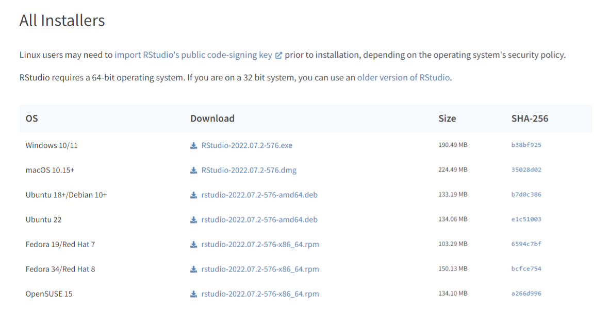

```{r setup, include=FALSE}
knitr::opts_chunk$set(echo = TRUE)
```

# BIOM549 Sequencing Workshop

## Introduction

Welcome to the BIOM549 bioinformatics workshop. The goal of this
workshop is to provide you with some basic insight in how RNA-Seq data
sets are analysed. Using this worksheet we will cover the following
Intended Learning Outcomes (ILOs) for this module.

4.  Interpret experimental data obtained using experimental techniques
5.  With minimal guidance, deploy established techniques of analysis,
    practical investigation and enquiry within the biosciences
6.  Critically evaluate experimental data

## Timetable 2022

There are two sessions for this workshop both taught in person. It is
not compulsory to attend but, these are the only times I am teaching. I
would highly recommend you attend them.

```{r table1, echo=FALSE, message=FALSE, warnings=FALSE, results='asis'}
tabl <- "
|Date & Time                  | Location          | Items                               |
|-----------------------------|-------------------|-------------------------------------|
|**Wed 30 Nov 13:30 - 16:30** |**Old Library 137**|**Analysis tutorial and walkthrough**|
|**Tues 13 Dec 09:30 - 12:30**|**Old Library 137**|**How to present your data**         |
"
cat(tabl)
```

I will also make myself available over teams and in person in between
seminars. Do contact me if you have any issues and I will help you solve
them.

```{r table2, echo=FALSE, message=FALSE, warnings=FALSE, results='asis'}
tabl <- "
|Date & Time             | Location            | Items                        |
|------------------------|---------------------|------------------------------|
|Wed 23 Nov 13:30 - 16:30|Teams / TBC          |Install RStudio and R packages|
|Wed 07 Dec 11:30 - 14:30|Teams / TBC          |Drop in session               |
|Wed 21 Dec 13:30 - 16:30|Drop in session      |Teams / TBC                   |
"
cat(tabl)
```

If you have any questions or queries outside of these times, you can
email me at [agb214\@exeter.ac.uk](mailto:agb214@exeter.ac.uk){.email}
and I will get back to you as soon as I can.

## Preface

In your first stream you should have either worked with Zebrafish,
plants or fungi. Each of those organisms would have been exposed to
differing environmental conditions, which in turn, should result in them
expressing a different genes in response. Knowledge of which genes are
expressed in different exposure conditions help us understand the hosts
response to stimuli. Measuring the difference in gene expression is the
goal of RNA sequencing and is what we will be aiming to achieve in this
tutorial. You are provided with the data sets which you will analyse.
Here we will only be focusing on the plant stream were a *Arabidopsis
thaliana* *pif4* mutant is grown at 22°C and 27°C with samples
collected at 2 and 7 days exposure.

### Hypothesis

1.  What genes are significantly upregulated and downregulated in the
    *pif4* mutant compared to our controls?
2.  What pathways do our genes of interest belong to?

### Data set link

Find the SharePoint link under "Data"
<https://vle.exeter.ac.uk/course/view.php?id=13271&section=10>

# Installation

When you turn up to the sequencing practical, you need to bring your
laptop. On your laptop you need to have R and RStudio installed before
you turn up for the sequencing practical. You can find instructions on
how to do this here.

1.  Install R version 4.2.1 for Windows/Mac/Linux
    <https://cran.rstudio.com/> 
2.  Install RStudio Desktop (Free version) for Windows/Mac/Linux
    <https://www.rstudio.com/products/rstudio/download/>
    
3.  To install R packages, open RStudio and in the console copy in the
    following

```{r, eval = FALSE}
install.packages(c("tidyverse", "WGCNA", "gridExtra"))
```

 4. After tidyverse has been installed
(it will take a couple minutes), install DESeq2 the same way

```{r, eval = FALSE}
if (!require("BiocManager", quietly = TRUE))
    install.packages("BiocManager")

BiocManager::install(c("DESeq2", "apeglm"))
```

# Analysis

This portion starts the analysis. You should have access to two files on
the sharepoint drive accessed through the BIOM549 VLE page. These are
labelled "metadata.csv" and "counts.csv". The metadata table is a
dataframe containing which samples belong to which experimental group.
The counts dataframe is the output from the preprocessing analysis. This
contains the number of reads that map to each *Arabidopsis* gene. Lets
take a look at the data.

## Set-up

First we need create a script. This is like making a word document and
records all the work you do. To make a script click File --> New File
--> R Script. You can write and run anything here. Click on the save
button and save this file somewhere sensible on your computer. Now
download the metadata and counts file from sharepoint and save it in the
same folder as your script. Everything we are going to do from now on
will be done in this folder.

Next we need to tell the computer where is folder is located and
everything we do should be done here. To do that go to Session --> Set
Working Directory --> To Source File Location. A command will now run in
the console that sets your working directory `setwd()`. Copy and paste
this command into your RScript, so that when you run this script again,
it always starts from the same place. Your script should look something
like this.

```{r}
setwd("C:/Users/agb214/OneDrive - University of Exeter/PhD/BIOM549")
```

Now we need to load in our libraries. This is like telling R all the
programs we want to use. Its good practice to include all your libraries
at the start of your script so anyone else running your script knows
what libraries they need to install to used your code.

```{r, message=FALSE, warning=FALSE}
library(DESeq2)
library(tidyverse)
library(apeglm)
#library(WGCNA)
#library(gridExtra)
```

Now we can finally load in and look at our data specifying the first
column of our data set is our row names.

```{r, message=FALSE}
count_data <- read.csv("count_data.csv", row.names = 1)
metadata <- read.csv("metadata.csv", row.names = 1)
```

```{r}
head(count_data)
head(metadata)
```

The command `head()` allows us to look at the first 5 rows of our data.
If we want to take a closer look we can instead use the `View()` command
which will open the data set in a new tab. Beware using `View()` on very
large data sets, you'll freeze your computer! For this exercise, you
should be fine.

```{r, eval = FALSE}
View(count_data)
View(metadata)
```

## Analysis

Next it is important the column names from our count data in the same
order as the rownames for the metadata. Without this, our downstream
software will combine the data incorrectly. Both these commands should
return "TRUE".

```{r}
all(colnames(count_data) %in% rownames(metadata))
all(colnames(count_data) == rownames(metadata))
```

Next we need to combine our count data with our metadata. We use a
package called DESeq2 which helps us keep track of multiple datasets in
one experiment. Before we do that, we need to tell DESeq2 which is our
control and experimental groups. To do this we set the column
"Experimental group" as a factor, meaning they are catagoies and the
first level (catagory) is "wildtype" or our control. Now we're good to
go.

```{r}
metadata$Experimental_group <- as.factor(metadata$Experimental_group)
metadata$Experimental_group <- relevel(metadata$Experimental_group, ref = "wildtype")

dds <- DESeqDataSetFromMatrix(countData = count_data,
                              colData = metadata,
                              design = ~Experimental_group)

dds
```

Notice when we type in `dds` into our console, we now have a
DESeqDataSet. Its told us we have a metadata table and count assay, with
our rownames as genes, columns as samples and metadata catagories as
Temperature, Experimental_group, Replicate and Days_exposure. Great!

### Pre-filtering

Next we should remove genes that aren't expressed frequently. This
removes the "noise" which helps us find significant trends. These genes
that are rarely expressed need to be in higher quantities so we can be
sure they are significantly expressed, so we remove them. Therefore, if
the gene is not expressed over 1000 times in our entire data set, it is
removed. 1000 is an arbitrary number and could be change depending on
the study, for example you could remove everything below the 95th
percentile.

```{r}
keep <- rowSums(counts(dds)) >= 1000
dds <- dds[keep, ]
```

Another example is remove any gene count that isn't at least 1000 in X
samples

```{r}
X <- length(colnames(count_data))
keep <- rowSums(counts(dds) >= 10) >= X
dds <- dds[keep, ]
```

It is up to you to decide what filter to use. For this tutorial I will
remove any gene count that is not at least 1000 in all samples. The
great thing about DDSeq2 is it does all our calculations for us. There
are

```{r, echo=F}
print(nrow(count_data))
```

genes in our data set. Imagine manually filtering each one out! This is
the power of using a coding language to analyse large data sets.

### Differential expression analysis

Now we calculate if the genes are statistically differential expressed.
We use the p.adjusted value to account for multiple retesting - the idea
that if you test for everything, by random chance you will find
something that is significant but its just a "lucky" pattern.

```{r, message=FALSE}
dds <- DESeq(dds)

# Define our p-value (alpha) cutoff as 0.05
res <- results(dds, alpha = 0.05)

# Give us a quick summary of the results
# LFC > 0 (up) is number of up regulated genes
# LFC < 0 (down) is the number of down regulated genes
summary(res)
print(paste0("Number of significantly up/down regulated genes: ", sum(res$padj < 0.05, na.rm=TRUE)))
print(paste0("Total number of genes in this dataset: ", nrow(assay(dds))))
```

So now we know there are a total number of genes that are significantly
up/down regulated. Lets plot this and see how different they are. ##\#
Plotting

```{r}
plotMA(res, xlim=c(50,20000), ylim=c(-2,2))
```

The dots in blue are significantly up/down regulated and the ones in
grey not. Lets take a closer look at the most significantly different
regulated gene.

```{r}
plotCounts(dds, gene=which.min(res$padj), intgroup="Experimental_group")
```

We can definitely see this gene is up-regulated in the *pif4* mutant

## Multi-factor analysis

Our experiment has multiple parameters, not just two different
Experimental groups. DESeq2 can account for this if you tell it. Lets do
that and see the results. Here we define all our groups, Temperature,
Experimental group (wildtype or mutant) and Days exposure (number of
days exposed to each temperature).Here we also include an interation
term: `Days_exposure:Temperature` which tells us if the number of days
exposed to each temperature together have an effect compared to if they
were individually measured.

```{r}
ddsMF <- dds
design(ddsMF) <- formula(~ Temperature + Experimental_group + Days_exposure, Days_exposure:Temperature)
ddsMF <- DESeq(ddsMF)
resMF <- results(ddsMF, alpha = 0.05)
summary(resMF)
```

Over half of the genes are up-/down-regulated. However, its expected
that at different temperatures and times gene expression will be
different. Lets just focus if these variables still have an effect on
the wildtype versus *pif4* mutant

```{r}
resMF <- results(ddsMF, contrast = c("Experimental_group", "wildtype", "pif4_mutant"), alpha = 0.05)
summary(resMF)
```

## Count transformations

When working with differential expression, we use raw counts as we are
treating them discretely. However, if we want to cluster groups, we
should transform the raw counts. DESeq2 has a number of transformation
functions, such as `vst`, `rlog` and `normTransform`. There are
advantages and disadvantages if each which I won't cover here. Instead,
i'm going to use `vst` short for variance stabilizing transformation.

```{r}
vsd <- vst(dds, blind=FALSE)
```

plotCounts(dds, gene=which.min(res\$padj),
intgroup="Experimental_group")

d \<- plotCounts(dds, gene=which.min(wt.vs.pif4\$padj),
intgroup="Experimental_group", returnData = T)

resSig \<- subset(wt.vs.pif4, padj \< 0.05)

ggplot(d, aes(x=Experimental_group, y=count)) +
geom_point(position=position_jitter(w=0.1,h=0)) +
scale_y\_log10(breaks=c(25,100,400))

ddsMF \<- DESeq(ddsMF)

resMF \<- results(ddsMF, alpha = 0.05)

vsd \<- vst(dds, blind=FALSE) plotPCA(vsd, intgroup = c("Days_exposure",
"Temperature"))

pcaData \<- plotPCA(vsd, intgroup=c("Days_exposure", "Temperature"),
returnData=TRUE)

percentVar \<- round(100 \* attr(pcaData, "percentVar")) ggplot(pcaData,
aes(PC1, PC2, color=as.factor(Temperature),
shape=as.factor(Days_exposure))) + geom_point(size=3) +
xlab(paste0("PC1: ",percentVar\[1\],"% variance")) + ylab(paste0("PC2:
",percentVar\[2\],"% variance")) + coord_fixed()
